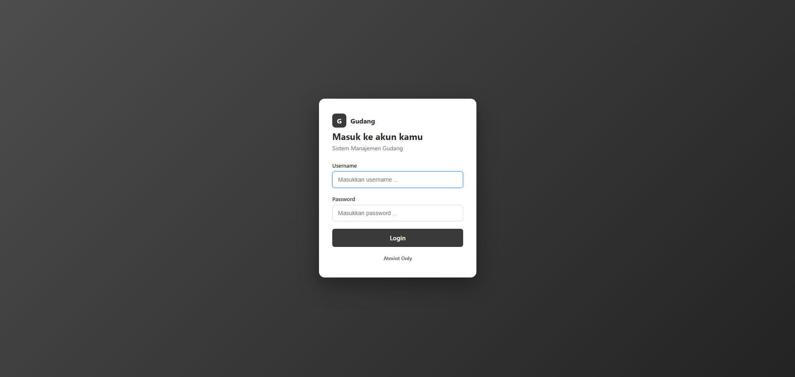
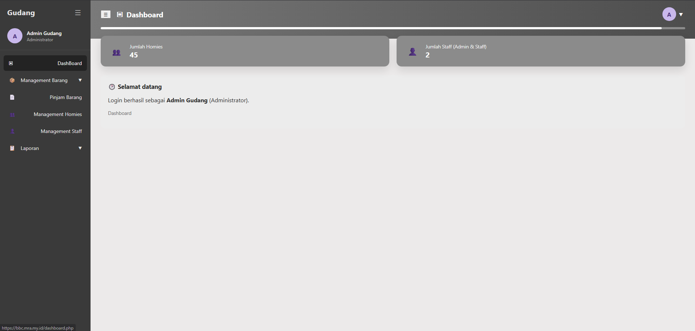
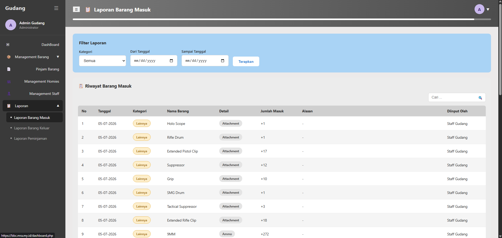
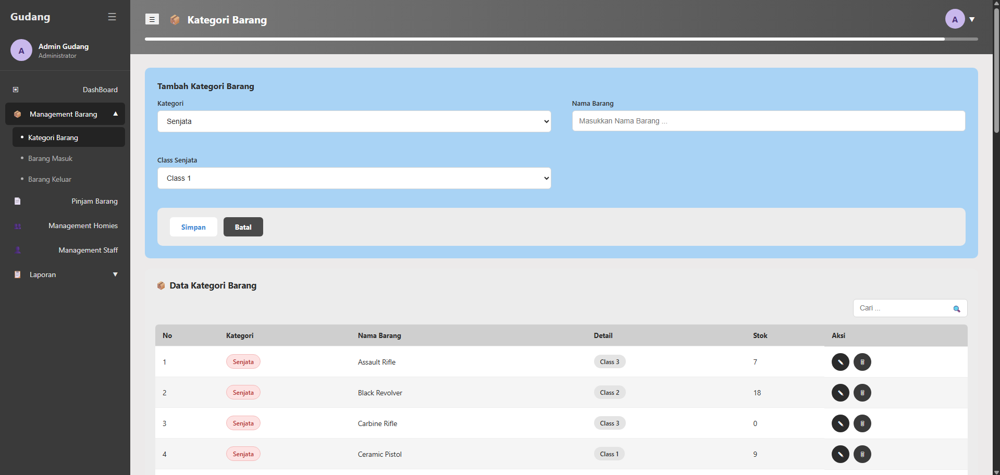
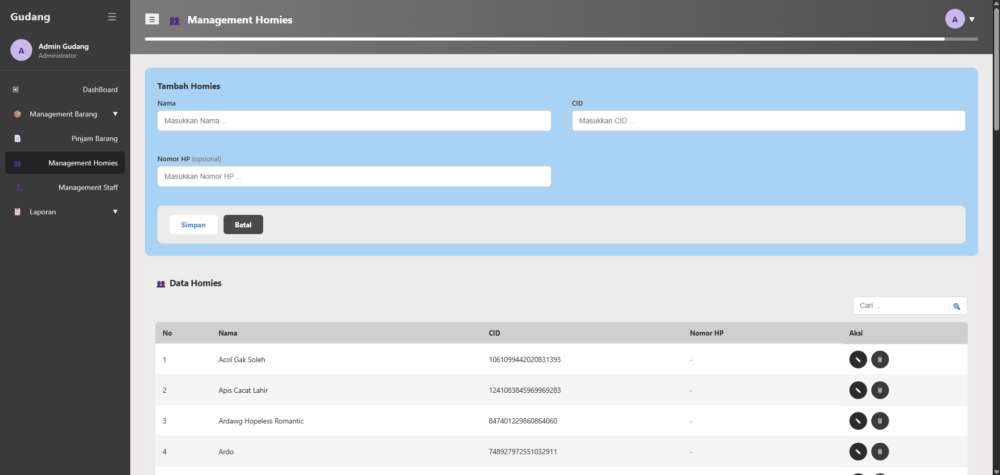

# Gudang - Sistem Manajemen Gudang

Aplikasi web sederhana (PHP native + MySQL, tanpa framework) untuk mengelola stok barang
(Senjata & Narko), data Homies (peminjam), dan peminjaman senjata, lengkap dengan laporan
riwayat masuk / keluar / peminjaman.

## Struktur Folder

```
warehouse/
├── config/
│   ├── db.php                    -> koneksi database (ubah host/user/pass di sini)
│   └── database.sql              -> script buat database + seed data + catatan migrasi
├── includes/
│   ├── auth.php                  -> session, require_login(), require_admin(), helper role
│   ├── header.php                -> head + layout + topbar (dipakai semua halaman)
│   ├── sidebar.php                -> menu sidebar (menu tertentu hanya tampil utk admin)
│   └── footer.php                 -> penutup layout + modal hapus + JS
├── staff/
│   ├── management_staff.php       -> (admin only) list akun + form tambah staff/admin
│   ├── edit_staff.php             -> (admin only) edit akun
│   └── hapus_staff.php            -> (admin only) hapus akun
├── homies/
│   ├── menajemen_homies.php       -> (admin & staff) list homies + form tambah homies
│   ├── edit_homies.php            -> (admin & staff) edit homies
│   └── hapus_homies.php           -> (admin & staff) hapus homies
├── barang/
│   ├── kategori_barang.php        -> (admin only) master data barang: Senjata (nama + class 1-4)
│   │                                  & Narko (nama + tag Bungkusan/Mentahan)
│   ├── edit_kategori.php          -> (admin only) edit kategori barang
│   ├── hapus_kategori.php         -> (admin only) hapus kategori barang
│   ├── barang_masuk.php           -> (admin & staff) input stok masuk (nambah stok existing)
│   └── barang_keluar.php          -> (admin & staff) input stok keluar + alasan (kurangi stok)
├── peminjaman/
│   ├── peminjaman.php             -> (admin & staff) form pinjam senjata + daftar peminjaman aktif
│   └── kembalikan.php             -> proses "Sudah Dikembalikan" (restock + catat barang masuk)
├── laporan/
│   ├── laporan_masuk.php          -> riwayat barang masuk + filter kategori/tanggal
│   ├── laporan_keluar.php         -> riwayat barang keluar + filter kategori/tanggal
│   └── laporan_peminjaman.php     -> riwayat peminjaman (event Pinjam & Dikembalikan) + filter
├── assets/
│   ├── css/style.css              -> SATU file CSS untuk semua halaman
│   └── js/script.js               -> interaksi sidebar, dropdown, modal, search-select, dsb
├── scripts/
│   └── discord_recap_peminjaman.php -> auto forward ke discord webhook | php /home/.../.../.../public_html/scripts/discord_recap_peminjaman.php
├── index.php                      -> halaman login
├── logout.php                     -> proses logout
├── ubah_password.php              -> ganti password akun sendiri
└── dashboard.php                   -> halaman setelah login (jumlah member & jumlah staff)
```

## Cara Menjalankan (XAMPP/Laragon)

1. Copy folder `warehouse` ke `htdocs` (XAMPP) atau `www` (Laragon).
2. Buka phpMyAdmin, import file `config/database.sql`
3. Cek `config/db.php`, sesuaikan `$DB_USER` / `$DB_PASS` kalau MySQL kamu pakai password.
4. Jalankan Apache + MySQL, lalu buka `http://localhost/warehouse/index.php`.

Butuh **PHP 7.0+** (pakai null coalescing `??`) dan ekstensi **mysqli** aktif — default sudah
aktif di XAMPP/Laragon versi mana pun.

## Akun Percobaan

| Username | Password | Role          |
|----------|----------|---------------|
| admin    | admin123 | Administrator |
| staff    | staff123 | Kepala Staff  |

## Fitur

- **Login & session**: hanya bisa masuk ke halaman manapun setelah login (`require_login()`);
  kalau belum login, otomatis diarahkan ke `index.php`.
- **2 Role**: admin & staff, disimpan di kolom `role` tabel `users`, dicek lewat `is_admin()`.
- **Dashboard**: kartu "Jumlah Member" (dari tabel `homies`) dan "Jumlah Staff (Admin & Staff)"
  (total akun di tabel `users`).
- **Management Staff** (khusus admin, otomatis redirect ke dashboard kalau staff coba akses
  langsung via URL): tambah, edit, hapus akun (tidak bisa hapus akun yang sedang login).
- **Profil dropdown** di pojok kanan atas (nama, role, tombol **Ubah Password** dan **Logout**).
- **Ubah Password**: verifikasi password lama, lalu simpan password baru (plain text).

- **Menajemen Homies** (admin & staff): tambah/edit/hapus data homies (nama, CID unik, nomor HP
  opsional). Data ini dipakai sebagai peminjam di modul Pinjam Barang.

- **Kategori Barang** (khusus admin — master data yang dipakai Barang Masuk, Barang Keluar, dan
  Pinjam Barang):
  - Kategori **Senjata** (Nama + Class 1–4) atau **Narko** (Nama + Tag Bungkusan/Mentahan).
  - Barang baru dibuat dengan stok awal 0 (stok ditambah lewat Barang Masuk).
  - Tidak bisa membuat barang duplikat (kategori + nama + class/tag yang sama).
  - Edit & hapus kategori barang (hapus juga menghapus riwayat masuk/keluar/peminjaman terkait).

- **Barang Masuk** (admin & staff):
  - Pilih Jenis Barang (Senjata/Narko). Untuk **Senjata**, nama barang dicari lewat search box
    (ketik nama, muncul opsi) — Narko tetap dropdown biasa.
  - Stok otomatis bertambah sesuai jumlah yang diisi.
  - Kolom **Alasan** bersifat opsional dan otomatis terisi kalau baris berasal dari pengembalian
    peminjaman (mis. "Dikembalikan oleh Budi Santoso (CID-0001)"); input manual tidak wajib diisi.
  - Tercatat ke **Laporan Barang Masuk**.

- **Barang Keluar** (admin & staff):
  - Sama seperti Barang Masuk (search box khusus Senjata), tapi stok **dikurangi** dan wajib
    mengisi **Alasan**.
  - Validasi stok: tidak bisa keluar melebihi stok yang tersedia.
  - Tercatat ke **Laporan Barang Keluar**.

- **Pinjam Barang** (admin & staff) — khusus kategori **Senjata**:
  - Form pilih **Nama Homies** dan **Nama Senjata** lewat search box (ketik nama/CID atau nama
    senjata, muncul opsi dari data Homies & Kategori Barang), lalu isi jumlah.
  - Stok senjata otomatis berkurang saat dipinjamkan, dan tercatat juga sebagai **Barang Keluar**
    (alasan otomatis "Dipinjam oleh [nama] ([CID])") supaya konsisten dengan histori stok.
  - Tabel **Peminjaman Aktif** menampilkan nama homies, CID, nama senjata, jumlah, tanggal
    pinjam, dan tombol **"Sudah Dikembalikan"**.
  - Klik tombol tersebut → baris hilang dari daftar aktif, stok senjata bertambah lagi, dan
    otomatis tercatat sebagai baris baru di **Barang Masuk** (alasan otomatis "Dikembalikan oleh
    [nama] ([CID])").

- **Laporan** (admin & staff):
  - **Laporan Barang Masuk**: riwayat semua barang masuk + kolom Alasan, filter kategori
    (Senjata/Narko) & rentang tanggal, plus total jumlah masuk.
  - **Laporan Barang Keluar**: riwayat semua barang keluar (kolom Alasan wajib), filter sama
    seperti di atas, plus total jumlah keluar.
  - **Laporan Peminjaman**: riwayat gabungan event **Pinjam** dan **Dikembalikan** per baris
    peminjaman (satu peminjaman bisa muncul 2 event kalau sudah dikembalikan), filter Alasan
    (Pinjam/Dikembalikan) & rentang tanggal, plus total dipinjam & total dikembalikan.

## Teknologi

- PHP native (tanpa framework) + `mysqli` (prepared statements di semua query yang menerima
  input pengguna).
- MySQL / MariaDB.
- Vanilla JS (tanpa library) untuk interaksi UI: toggle sidebar, accordion menu, modal
  konfirmasi hapus, filter tabel client-side, dan komponen search-select (combobox).
- 1 file CSS (`assets/css/style.css`) untuk seluruh halaman, tanpa CSS framework.

### 📄 Tampilan 1


### 📄 Tampilan 2


### 📄 Tampilan 3


### 📄 Tampilan 4


### 📄 Tampilan 5

